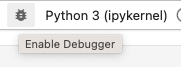

---
jupytext:
  formats: md:myst
  text_representation:
    extension: .md
    format_name: myst
kernelspec:
  display_name: Python 3
  language: python
  name: python3
---

# Debugging code in Jupyter Lab

The process of fixing errors in code is known as **debugging**.  A software **bug** is an error in your code that makes your program stop or not run as it should be. 
Debugging your code can also be useful when you want to understand properly what your code is doing.  Jupyter Lab has an in-built debugger.  The Jupyter 
Lab debugger allows you to execute your code one line at a time.  This is very useful when dealing with complex code as 
it can help you understand how the values of your variables are changing in memory.

To debug your code in Jupyter Lab, click on the *Enable Debugger* icon  present at the top right-hand corner of Jupyter Lab.
Once this is clicked, you will be able to insert a **breakpoint** in your code.  To create a breakpoint, click on the gutter 
next to the line of code where you want your breakpoint to be.


```{figure} images/breakpoint-jupyterlab.png
---
name: breakpoint-jupyterlab
---
A breakpoint on line 4 in Jupyter Lab.
```

As shown in {numref}`breakpoint-jupyterlab`, the red dot, is the breakpoint.  Next, click on the *Run cell* button .  
The code will start executing until it reaches the first breakpoint which pauses the code from executing, 
allowing you to see the values of the variables at that point.  In the example below, we can see that when the code 
pauses execution on line 4, `i` and `j` has the value of 0.

```{figure} images/variables-jupyterlab.png
---
name: variables-jupyterlab
---
Variables pane in Jupyter Lab
```

To run one line of code at a time, click on the Next button  present on the Callstack pane on the right-hand side. This is 
very useful as it allows you to check what is happening in your code.  You can put as many breakpoints as you want in your code.  Pressing the Continue button  
that is present on the Callstack pane will resume execution of your code until the next breakpoint is reached.

````{admonition} Do you know?
:class: tip

The term **bug** was first used in 1946 by **Grace Hopper**, a computer science pioneer.  A moth was trapped in a relay, which caused a malfunction in the 
electricalmechanical computer leading eventually to the word "bug" to refer to errors in code.
 
```{figure} images/grace-hopper.jpeg
Grace Hopper ([Wikipedia](https://commons.wikimedia.org/wiki/File:Grace_Hopper_and_UNIVAC.jpg))
```
````


