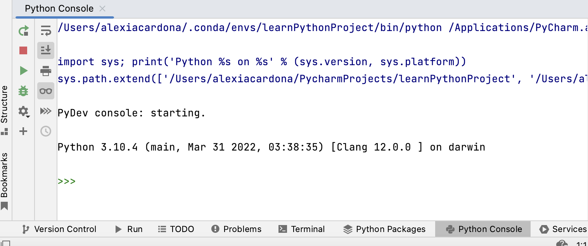

### Python Console

You can interact with the Python interpreter via the Python Console pane at the bottom of PyCharm's screen (as shown below). 

  
The console displays `>>>` to indicate that it is expecting a command as an input. After writing the command, pressing 
the `<Enter>` key will execute the command.  The output of the command is then displayed in the console.

A good way to use the Python Console is to use it as a calculator. Below are some of the most used mathematical operations.  

```{list-table} Numeric Operators and Functions
:header-rows: 1
:name: numeric-operators-table

* - Operator/Function
  - Description
  - Example
* - \+
  - Addition
  - 1 + 2 returns 3
* - \-
  - Subtraction
  - 3 - 1 returns 2
* - \*
  - Multiplication
  - 3 * 4 returns 12
* - /
  - Division
  - 4/2 returns 2.0
* - //
  - Floor division: returns the integer part of a division result (without the fraction part)
  - 5//3 returns 1
* - \%
  - Remainder
  - 5 % 2 returns 2
* - **
  - to the power of
  - 3 ** 2 returns 9
* - `pow(x, y)`
  - x to the power of y (same as **)
  - `pow(3, 2)` returns 9
* - `abs(x)`
  - absolute value of x
  - `abs(-5)` returns 5
* - `round(x, n)`
  - rounds x to n decimal places
  - `round(3.142, 2)` returns 3.14
```
Python follows the traditional mathematical rules of precedence (BODMAS).  You can find more about these rules 
[here](https://www.mathsisfun.com/operation-order-bodmas.html).

```{exercise} Arithmetic Operators
:label: arithmetic-operators

**Level:** {octicon}`star-fill;1em;sd-text-warning` {octicon}`star;1em;sd-text-warning` {octicon}`star;1em;sd-text-warning`
  
a. Try the examples in {numref}`numeric-operators-table` in the Python Console.  
b. Calculate: $8 + (10 + 4^3 + 2)$
```


# Notebooks

```{exercise-start} Exploring code cells
:label: code-cell1
```
**Level:** {octicon}`star-fill;1em;sd-text-warning` {octicon}`star;1em;sd-text-warning` {octicon}`star;1em;sd-text-warning`

Explore writing Python code in code cells.  Write the code shown in {numref}`jupyter-code-cell`, and execute it in a Jupyter Notebook.
```{exercise-end}
```****


```{exercise-start} Explore how others do Notebooks
:label: explore-notebooks
```
**Level:** {octicon}`star-fill;1em;sd-text-warning` {octicon}`star-fill;1em;sd-text-warning` {octicon}`star;1em;sd-text-warning`

This [link](https://github.com/jupyter/jupyter/wiki) contains different examples of Jupyter Notebooks for you to explore. Look into a few Notebooks and check 
the .ipynb files to see how others are displaying content in Notebooks..

```{exercise-end}
```


