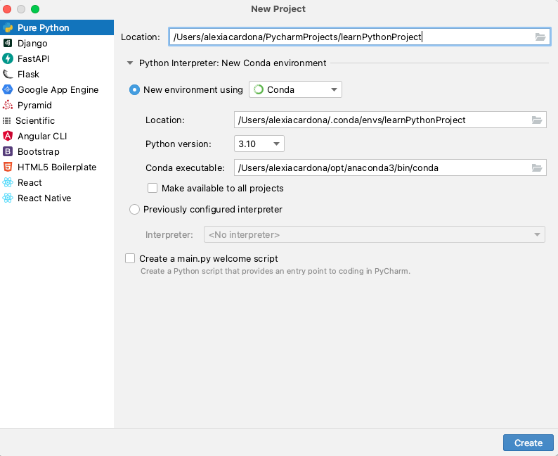
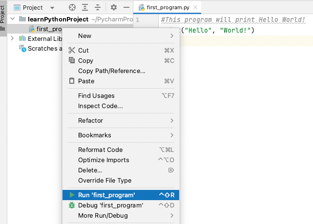
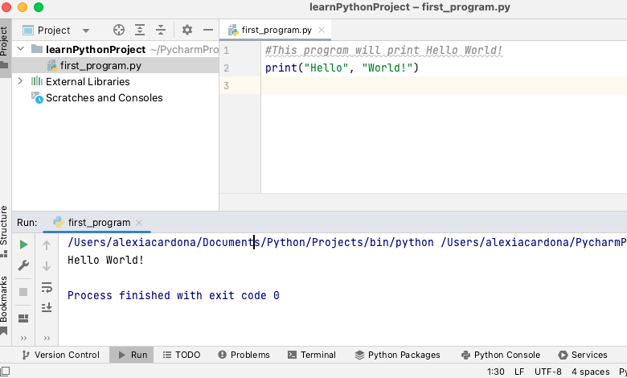

---
jupytext:
  formats: md:myst
  text_representation:
    extension: .md
    format_name: myst
kernelspec:
  display_name: Python 3
  language: python
  name: python3
---

# Introduction to Python Programming

## What is Python?

Python is a popular programming language [^survey-python], especially in the field of data science. Python was named after the “Monty
Python’s Flying Circus” BBC show (not after the reptile!)[^python-doc-tutorial].
The Python language has three very desirable features:
1. Python is an interpreted language; this means that it has an interpreter that runs the code line by line
   (rather than having to build the whole program before running it as in compiled languages for example).
2. Python is an Object-Oriented Programming (OOP) language, offering more structure and reusability for larger programs.
3. Python is a Very High-Level Language (VHLL); allows one to express complex operations in one statement.


## Why learn Python?

There are many good reasons why it is a good idea to choose to learn Python:

* **Easy to learn**: Python is one of the easiest programming languages to learn as it is readable as its syntax is very
  similar to
  English.
* **Automate tasks**: Instead of using a series of clicking and mouse operations, write your code in a file once and
  then
  just run it whenever you need it.
* **Promotes reproducibility**: Once you have your code you can share it with your colleagues or publish it, so that
  others will be able to generate the same results as you have. Reproducibility is when others or yourself are able to
  generate the same results using the same data and analysis.
* **Support**: As a widely used programming langauge, Python has a large community. There are lots of resources and help
  available online.
* **Free**:  Python is free to use.
* **Open source software**
* **Cross-platform**:  Python runs on different operating systems.  
  Hopefully all this has convinced you that Python is a great programming language to learn. Before starting coding in
  Python, in the next section, we are going to introduce PyCharm, the tool that we will be using throughout the course
  to code Python in.  


## Creating a Python program (.py)

We will start learning Python by creating a simple Python program.   To create a Python program, you can write your code 
using a simple text editor and then use the Python interpreter directly through your command line to run your code.  If 
you have used an IDE before to develop code however, you will certainly not do that.  An IDE (Integrated Development Environment) 
is a tool that enables programmers to write code productively by combining different tools and resources that are commonly 
used when writing code, into one application.  There are several popular IDEs used to code Python.  In this example, we will 
be using PyCharm as it is one of the most popular tools used to develop Python code (the top one according to the 
[Python Software Foundation survey](https://www.jetbrains.com/research/python-developers-survey-2018/)). It is a tool used 
not just in academia but also in industry by small to big companies.


### Creating a Project in PyCharm

Before writing code in Python, we need to create a project in PyCharm.  A project allows you to keep track of 
the files and environment associated to your code. 

:::{card} Steps to create the PyCharm Project:
{bdg-primary}`PyCharm`
1. In PyCharm's Welcome screen, click **New Project**.
2. Choose **Pure Python** to create a Python project.  Choose the location of the project in the **Location** field.  
Name your project `learnPythonProject`.
3. Choose **Conda** in the **New environment using** field as shown below.

4. Now click the **Create** button to create the project.

:::

### Creating and running Python files

We will start learning Python by writing the classic “Hello World!” program which is normally the first thing you learn 
in any classic programming textbook.  

:::{card} Steps to create a Python file in PyCharm
{bdg-primary}`PyCharm`
1. Select **File**|**New**|**Python file** from the menu.
2. Write the name of the Python file in the field provided (in this example we will be using the name `first_program`).  

3. PyCharm creates a source code pane to edit the file `first_program.py`.  *Note: A python file has an extension of `.py`.*
Write the code below in the `first_program.py` file:

4. Run the Python file `first_program` in PyCharm by right-clicking on the file in the Project pane, and select **Run
'first_program'** from the menu.  If you want to use the keyboard to run the code, use the shortcut shown next to the 
**Run 'first_program'** menu.  For mac this is **^ Shift R** buttons.

5. The output of `first_program.py` is displayed in the **Run** tool window at the bottom of PyCharm's screen.

6.  Select **View**|**Toolbar** to display the run/debug tool buttons on the top menu for easy access.

:::

Python programs are executed by the Python interpreter.  Python starts executing each line of code in a file, starting 
from the first one and progressing line by line to the very end of the file.  Now let's look at the code in 
`first_program.py`. The first line is a **comment**.

:::{card} Comment
:class-card: sd-bg-light

{bdg-info}`Programming concept`

Comments are non-executable line of code that are used to explain Python code. A comment starts a line of code with a `#` and continues till the end of that line.
:::

The second line uses the `print()` function to output the text *Hello World!*. 

To run a Python file outside PyCharm, in a command line, use the following code:  
$python$ $<name$ $of$ $Python$ $file>$  

```
# to run first_program.py use the code
python first_program.py
```


  
[^survey-python]: [Stackoverflow Developer Survey 2022](https://survey.stackoverflow.co/2022/#most-popular-technologies-language)
[^python-doc-tutorial]: [Python Documentation Tutorial](https://docs.python.org/3/tutorial/index.html)
