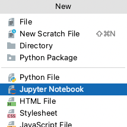
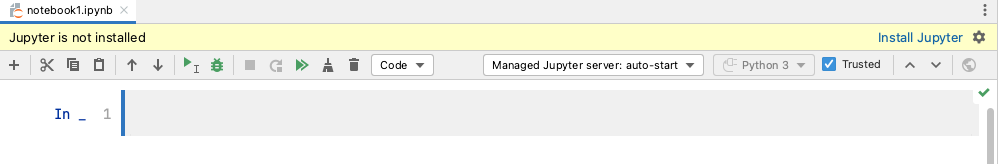
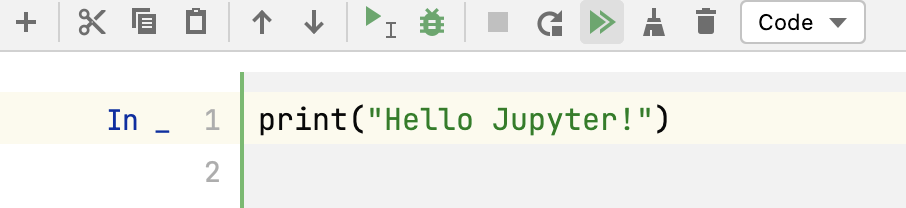
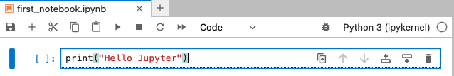
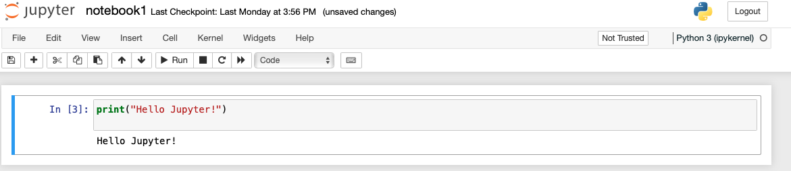
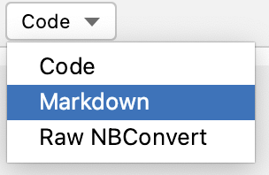
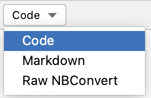

# Jupyter Notebooks

## What are Jupyter Notebooks?

Jupyter Notebooks are a Python way of doing **literate programming**, that is, incorporating natural language, *e.g.,* English with 
your source code.  So rather than having a word processing document containing all your text, and a .py file containing 
your source code, Jupyter Notebooks combines functionality of both into one document. Jupyter Notebook is a web application to make 
our analysis/code reproducibile, one of the qualities that are being promoted in research to be compliant with FAIR 
standards (**F**inadble **A**ccessible **I**nteroperable and **R**eproducible).

The name Jupyter is a play on Jupyter's core programming languages: **Ju**lia, **Pyt**hon, **R**.  The circles in the Jupyter 
logo are attributed to the Galileo's moons of Jupiter discovery.  
```{figure} images/jupyter.png
---
name: jupyter
---
Jupyter logo.  Image from jupyter.org.
```

Jupyter Notebooks support different programming languages.  Each programming language has a **kernel** which executes the code cells
in the Jupyter Notebook.  For Python, the kernel is called **IPython**.  A Jupyter Notebook has an `.ipynb` extension which 
stands for **IPy**thon **N**ote**b**ook.  

```{figure} images/jupyter-components.png
---
name: jupyter-components
---
The different components of the Jupyter ecosystem that enable execution of a Jupyter Notebook [^1].
```
{numref}`jupyter-components` show the differnt components that interact with a Jupyter Notebook file and process it to be 
displayed in a web browser. The Jupyter Notebook file, kernel and browser communicate together via the Jupyter Notebook Server.


## Creating Jupyter Notebooks in PyCharm
Now let us get started and see how we can create Jupyter Notebooks in PyCharm.  As always, you need to be either already in a 
PyCharm project.  If not create a new Pure Python PyCharm project (instructions [here](https://ac812.github.io/mcb-python/intro-to-python.html#creating-a-project-in-pycharm)).

To create a new Jupyter Notebook:  
1. Select **File|New|Jupter Notebook** from PyCharm's main menu.  

2. Enter `notebook1` as the name your new Jupyter Notebook.

3. The Jupyter Notebook is now displayed in PyCharm. If this is your first time creating a Jupyter Notebook in PyCharm, 
most likely you will get a message at the top of Jupyter Notebook file saying that "Jupyter is not installed". If so,
click on the **Install Jupyter** link on the right hand side. This will install the package `Jupyter`.

When this is installed, you would be able to add content to your Jupyter Notebook file.

## Running Jupyter Notebooks 
1. In the code cell displayed enter the following code `print("Hello Jupyter!")` as follows:

2. After clicking the **Run All**  button you would get the output displayed underneath the code cell as follows:

3. To display your Notebook in a browser, click on the **Open Notebook in Browser**  button in the notebook toolbar.
This will open the Notebook in your browser and it will be displayed with the classic Jupyter Notebook interface:



## Jupyter Notebook Cells

To add content on the Jupyter Notebook, we need to add cells to it. You can add as many cells as you need in your Notebook. 
Cells can be of three types:
1. Code
2. Markdown
3. Raw NBConvert

In this course we are going to look at the two popular ones, which is Code and Markdown.


### Markdown Cells

Markdown Cells are cells that contain Markdown.  Markdown is a markup language that is used to format text. In this section
we are going to look at different formatting options to make our text more structured and user friendly.  
To add a Markdown cell:  
1. Choose `Markdown` from the dropdown list in the notebook toolbar.

2. Then click on the **Add Cell Below** button . 
3. This will add Markdown cell in your Jupyter Notebook. Click on the cell and start typing your Markdown.
4. Click on the **Run Cell and Select below**  button in the notebook toolbar to run the code in that cell only, or **Run All**  button to run all the cells of the Notebook.


#### Headings

Below is the Markdown code you need to use to specify headings at different levels and the rendered output respectively below the code:

`# Heading 1`

<p style="font-weight:500; font-size:34px">Heading 1</p>

`## Heading 2`

<p style="font-weight:500; font-size:30px">Heading 2</p>

`### Heading 3`

<p style="font-weight:500; font-size:24px">Heading 3</p>

`#### Heading 4`

<p style="font-weight:500; font-size:18px">Heading 4</p>

#### Inline text formatting

To make text **bold** use `**double asterisks**` or `__double underscores__`.  
To make text *italic* use `*asterisks*` or `_underscores_`.  
To make text ^superscript^ use `^caret^`.  
To make text ~subscript~ use `~tilde~`.  
To mark text as `inline code` use `` `backticks` ``.   
To  ~~strikethrough~~ text use `~~double tilde~~`.

#### Line breaks
To create a line break, put more than 2 spaces at the end of a sentence.

```{exercise-start} Markdown in Jupyter Notebook
:label: markdown1
```
**Level:** {octicon}`star-fill;1em;sd-text-warning` {octicon}`star-fill;1em;sd-text-warning` {octicon}`star;1em;sd-text-warning`

Replicate the output of the text below in a new Jupyter Notebook `notebook2`. 

The text comes from [a paper by Monya Baker](https://www.nature.com/news/1-500-scientists-lift-the-lid-on-reproducibility-1.19970) 
that was published in 2016 in the Nature journal that triggered the discussion about Reproducibility Crisis.

```{exercise-end}
```

#### Links

##### Linking text to Headers

To link text to a header use `[link to header](#section-title)`. Inside the parenthesis, titles are written in lower case letters
and spaces are converted to a hyphen, for example, `[link to header](#markdown-cells)` will be rendered as [link to header](#markdown-cells).

##### Linking text to a webpage

To create a link to a webpage use `[text of link](https://jupyter.org/)`.  This is rendered as [text of link](https://jupyter.org/). 

#### Footnotes

To indicate a footnote use`[^2]` and, for example, indicate another one as`[^3]`, then specify the wordings of the footnotes as:

`[^2]: This is the first footnote.`  
`[^3]: This is the second footnote.`

You do not need to put footnotes at the end of the document for them to be rendered there.  This example is rendered as follows:  

To indicate a footnote use[^2] and, for example, indicate another one as[^3] and then specify the wordings of the footnotes as:

[^2]: This is the first footnote.  
[^3]: This is the second footnote.

#### Lists

##### Ordered lists

To create an ordered list use the following syntax:

```
1. Item 1
2. Item 2
3. Item 3
```

This is rendered as:

1. Item 1
2. Item 2
3. Item 3

Use 4 spaces to indent an item if you would like to have sub-lists:
```
1. Item 1
2. Item 2
3. Item 3  
    a. Item 3a  
        i.  Item 3ai  
        ii. Item 3aii  
    b. Item 3b  
    c. Item 3c  
4. Item 4
```

1. Item 1
2. Item 2
3. Item 3  
    a. Item 3a  
        i.  Item 3ai  
        ii. Item 3aii  
    b. Item 3b  
    c. Item 3c  
4. Item 4

##### Unordered lists

In an unordered bulletted list, each item begins with `*`, `+` or `-`.  Example:

```
* Item 1
* Item 2
* Item 3
    * Item 3a
        *  Item 3ai
        * Item 3aii
    * Item 3b
    * Item 3c
* Item 4
```
Will be rendered as:

* Item 1
* Item 2
* Item 3
    * Item 3a
        *  Item 3ai
        * Item 3aii
    * Item 3b
    * Item 3c
* Item 4

#### Inserting images
To insert an image use the following syntax: ``.  Example:

``

Will be rendered as:


```{exercise-start} More Markdown
:label: markdown2
```
**Level:** {octicon}`star-fill;1em;sd-text-warning` {octicon}`star-fill;1em;sd-text-warning` {octicon}`star;1em;sd-text-warning`

Continue working on `notebook2.ipynb` from the {numref}`markdown1`. Extend the output of `notebook2.ipynb` to look like
[this](notebook-solutions/notebook2.ipynb).  
You can find the image used in this exercise at this location:
https://www.nature.com/news/polopoly_fs/7.36716.1469695923!/image/reproducibility-graphic-online1.jpeg_gen/derivatives/landscape_630/reproducibility-graphic-online1.jpeg

```{exercise-end}
```

### Code Cells
You can write your Python code in **code cells** in your Notebook.   
To create a code cell:  
1. Choose **Code** from the dropdown menu that contains the type of cells for the Notebook in the notebook toolbar.  

2. Click on the **Add Code Cell Below** button button on the notebook toolbar in 
PyCharm. 
3. A cell will be created. You can now start writing your Python code inside the code cell.
4. As before, to run the code cell, click on the **Run Cell and Select below**  button in the notebook toolbar to run the code in that cell only, or **Run All**  button to run all the cells of the Notebook.

Below is an example of how a code cell and its output after running the code cell will look in your Notebook.  
```{figure} images/jupyter-code-cell.png
---
name: jupyter-code-cell
---
An example of a code cell in Jupyter Notebook and its output.
```

```{exercise-start} Exploring code cells
:label: code-cell1
```
**Level:** {octicon}`star-fill;1em;sd-text-warning` {octicon}`star;1em;sd-text-warning` {octicon}`star;1em;sd-text-warning`

Explore writing Python code in code cells.  Write the code shown in {numref}`jupyter-code-cell`, and execute it in a Jupyter Notebook.
```{exercise-end}
```


### Submitting/Sharing a Jupyter Notebook
Once you have finished writing your Notebook, go to the location where you have your PyCharm Project and you should be able to see your Notebook file/s (`.ipynb`) in that folder. You can send the .ipynb file to some one or upload it to a drive for example. If you have created folders with data in your project 
that are used in the .ipynb file, than make sure to also load the whole project folder that contains the folder with the data and the .ipynb file it, so that the functions that 
use that data are not disrupted in your code.  
**Make sure that you have saved your code and have run the Notebook successfully before sending or submitting it!**


```{exercise-start} Explore how others do Notebooks
:label: explore-notebooks
```
**Level:** {octicon}`star-fill;1em;sd-text-warning` {octicon}`star-fill;1em;sd-text-warning` {octicon}`star;1em;sd-text-warning`

This [link](https://github.com/jupyter/jupyter/wiki) contains different examples of Jupyter Notebooks for you to explore. Look into a few Notebooks and check 
the .ipynb files to see how others are displaying content in Notebooks..

```{exercise-end}
```

[^1]: Image from https://docs.jupyter.org/en/latest/projects/architecture/content-architecture.html


